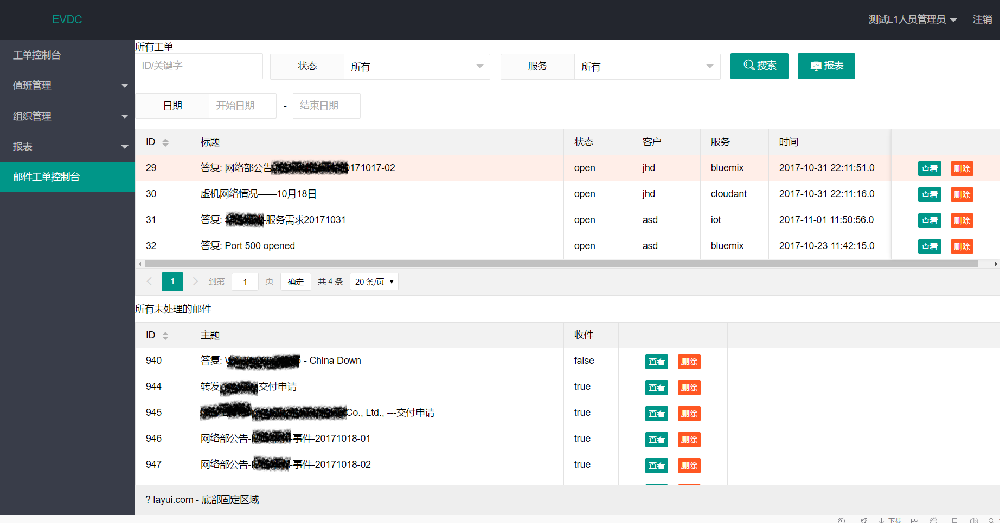

# evdc

在此项目中是边学边做，中间遇到了很多坑，也确实学到了不少东西，后续整理一些放自己博客上。
###**springmvc + mybatis + layui + tomcat** 邮件用的是ews-java-api 
项目最终没有完结，只做了第一期的功能  

数据库文件：evdc-db20180224.sql 只有数据结构，没有数据  

需求文档暂时不会上传  
项目截图如下

